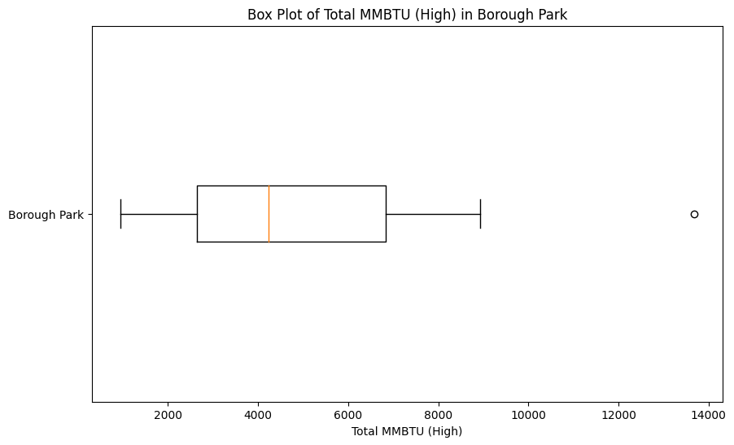
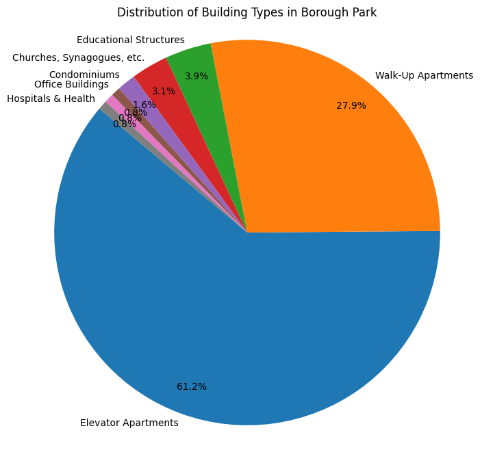

# Borough Park

## Highlighted Borough Park Map (HC6)

## Basic Statistics and Demographics (HC2)

Borough Park, situated in southwestern Brooklyn across zip codes 11204, 11218, 11219, and 11220, is home to approximately 172,000 residents, with a gender distribution of 50.55% males and 49.45% females. Noteworthy demographics include a 23.8% foreign-born population, 11.5% aged 65 or older, and a predominant white ethnicity at 67.4%, with significant representation from the Hasidic Jewish community comprising about 70% of the Jewish population. The neighborhood's median household income is $61,280, 15% lower than the NYC median, and exhibits an income diversity ratio of 5.5. Socioeconomic challenges include a 23.8% poverty rate, 18.5% lacking a high school diploma, and an unemployment rate of 13.22%, significantly higher than the NYC average. Housing features a 32.6% homeownership rate, varying median prices, and a median gross rent of approximately $1,730. The population density is 54,800 per square mile, with 9.5% of renter households experiencing severe crowding. Commuting patterns reveal 57.5% not using cars, with an average commute time of 34.9 minutes. The serious crime rate stands at 6.1 incidents per 1000 residents.

## HC3 Summary

The NYC Clean Heat Program promotes sustainable heating and cooling practices, advocating for the adoption of environmentally friendly alternatives such as cold climate air source heat pumps and ground source heat pumps. By discouraging the use of fossil fuels, the program not only benefits the environment but also improves individual health by reducing the emission of harmful toxins from traditional heaters. The DEP Boiler Registration addresses air pollution concerns by monitoring and regulating soot emissions from older buildings, contributing to cleaner air in the city. Additionally, the Greener Greater Buildings Plan focuses on energy efficiency, targeting buildings responsible for a significant portion of NYC's energy consumption. Mandating benchmarking, audits, and upgrades, the plan values transparency in energy usage and aims to build a workforce capable of delivering greater energy efficiency. For effective transition to clean heating fuels, careful fuel selection, secure financing, and efficient coordination among parties involved are crucial to ensure a smooth and environmentally responsible shift.

## HC4 Summary
The Climate Mobilization Act of 2019 aimed to curb carbon emissions from NYC buildings, revealing that only 25% have an A energy efficiency rating, with 56% of home energy dedicated to space heating, predominantly fueled by oil. NYC's greenhouse gas emissions primarily stem from fossil fuel combustion, impacting 30% of the city's carbon footprint through building heating and cooling. The surge in global air conditioning use, notably in the U.S. with 40% of units, poses challenges due to energy consumption and the release of harmful refrigerants like hydrofluorocarbons. Other emission sources include natural gas and petroleum combustion in cooking and food production. NYC recently passed a bill banning fossil fuels in new buildings by 2026 (under seven stories) and 2029 for larger structures, mandating all-electric alternatives. In Brooklyn, notable efforts to reduce emissions include the Brooklyn Public Library's 16% reduction in 28 buildings through LED lighting, smart monitors, and HVAC upgrades, saving 3,500 metric tons of CO2. The library promotes sustainability by offering Home Energy Audit Toolkits, equipped with thermal imaging cameras and electricity monitoring systems, to educate and empower families in reducing energy consumption. This comprehensive approach reflects a growing awareness of the environmental impact of various activities within the city.

## HC7/HC8 Summary
IN SUMMARY Brooklyn has experienced the greatest population growth in the past ten years and currently is the most population dense.
From our research regarding the NYC Clean Heat Program in HC 3, we encountered the Types of Fuel Oils (No. 4 and No. 6), where No. 6 was revealed to create more environmental destruction due to it being heavy fuel for power plants and ships. Such claims from our research are proven to be correct, as in the neighborhoods in Brooklyn such as Flatbush, Brooklyn Heights, Ocean Parkway, and Borough Park convey the No. 6 type fuel oil contributing to equal or higher fuel usage.

### Plots

Let's see how these high average fuel usage affect the Total MMBTU values. This box plot illustrates the ranges of total MMBTU use in Borough Park. MMBTU stands for Metric Million British Thermal Unit and it measures the heat content of fuel.

This pie chart categorizes the unique building types in Borough Park and calculates the rate of each category. We can see from the chart that the vast majority of buildings in Borough Park are apartments, mainly Walk-up and Elevator apartments. There is also an ample amount of educational and religious structures in Borough Park.

## Borough Park Map

<dl>
<iframe src="files/boroughparkmap.html" width="600" height="400" frameborder="0" frameborder="0" marginwidth="0" marginheight="0" allowfullscreen></iframe>
</dl>

